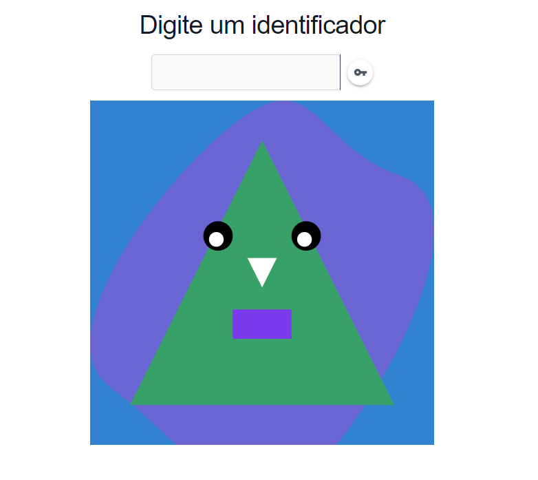
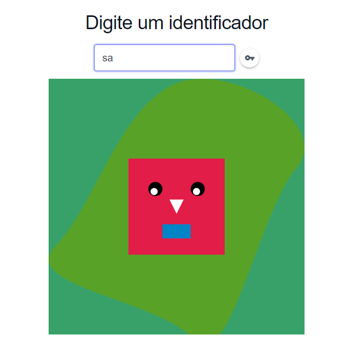
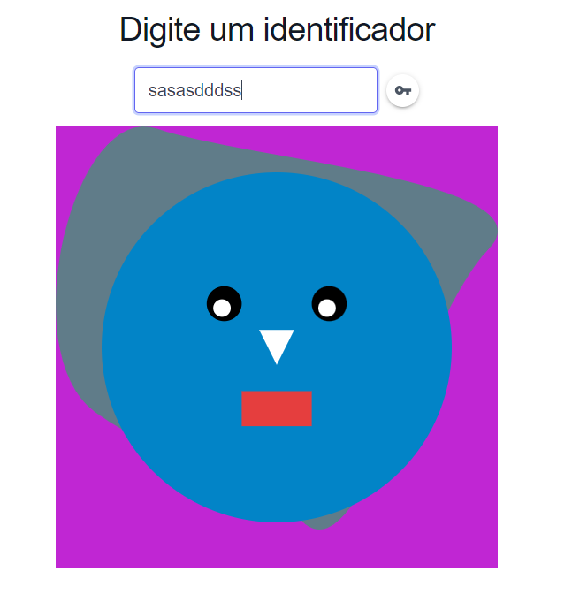

# Gerador de Icons - UC Computação gráfica e realidade virtual 

## Integrantes do grupo

- Lucas Marchesoni Silvério da Silva - RA: 82117246

- Jonas Neres da Silva - RA: 821142288

- Otávio Fontes Silva - RA: 821146361

- Lucas Simões Biffi - RA: 821134027

- Gabriel Piotto Guedes da Macena - RA: 821148371

- Marcello Meirelles Azevedo - RA: 821238301

## O projeto

O projeto consiste em criar um gerador de icons a partir de uma chave aleatória e única que é gerada pelo usuário ao digitar no campo de texto.


## Como rodar o projeto

Fazer um clone do projeto no github:

```
git clone https://github.com/jnsneres/ProjetoCGRV1Sem2024.git

```

Abrir a pasta no vscode e instalar as dependências:

```
npm install
```

Rodar o projeto:

```
npm run dev
```

## Exemplos de Ícones


